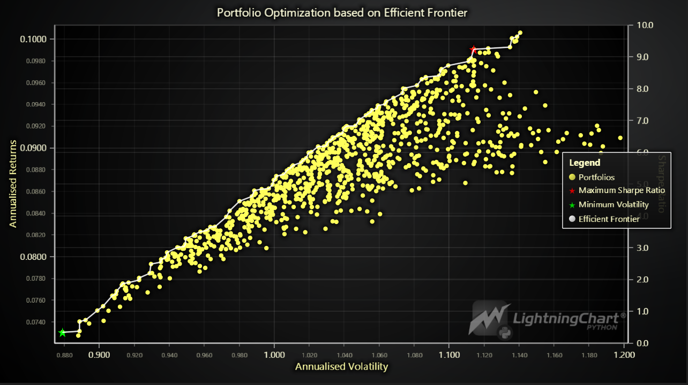

## Portfolio Performance Tracking and Optimization with LightningChart Python

### 1. Introduction

#### 1.1 What is Investment Portfolio Optimization?

Investment portfolio optimization is a crucial aspect of financial management that focuses on maximizing returns while minimizing risk. It involves selecting the best mix of assets to achieve a specific investment goal. The main principles include:
- **Risk**: The potential loss in value of an investment.
- **Return**: The gain or loss generated by an investment.
- **Diversification**: Spreading investments across different assets to reduce risk.

Portfolio optimization balances these elements to construct an efficient portfolio. By using historical data and various mathematical models, investors can optimize their portfolios to achieve the best possible performance given their risk tolerance and investment goals. So, this project aims to minimize the risk associated with the portfolio by using portfolio management techniques.

#### 1.2 Techniques for Investment Portfolio Optimization

Several techniques are employed in investment portfolio optimization, including:
- **Mean-Variance Optimization (MVO)**: Developed by Harry Markowitz, this method focuses on maximizing returns for a given level of risk through diversification.
- **Sharpe Ratio Maximization**: This approach aims to maximize the ratio of return to risk that is used in this project.
- **Black-Litterman Model**: Incorporates investor's views with market equilibrium.
- **Monte Carlo Simulation**: Uses random sampling to estimate the probability of different outcomes in investment returns.

#### 1.3 Advantages of Using Python for Portfolio Optimization

Python offers several advantages for portfolio optimization:
- **Extensive Libraries**: Libraries like NumPy, pandas, and SciPy provide robust tools for financial calculations.
- **Visualization Tools**: Libraries such as LightningChart offer powerful data visualization capabilities.
- **Flexibility and Integration**: Python can easily integrate with other software and systems, enhancing its versatility.
- **Community and Support**: A large community of developers and extensive documentation make Python an accessible and reliable choice.

### 2. LightningChart Python

#### 2.1 Overview of LightningChart Python

LightningChart Python is a powerful data visualization library designed for creating high-performance, real-time charts. It is particularly well-suited for financial data visualization, making it an excellent choice for investment portfolio optimization projects.

#### 2.2 Features and Chart Types to be Used in the Project

LightningChart Python offers a variety of features and chart types, including:

- **Line Series**: Ideal for displaying continuous data points connected by straight lines, useful for showing trends over time.
- **Scatter Chart**: Chart type for visualizing collection of two-dimensional points.
- **Grouped Bar Chart**: Similar to the bar chart, but groups bars together based on additional categories, facilitating comparison within groups.
- **Box Plot**: This chart type is used for visualizing data groups through quartiles.
- **Dashboard**: Dashboard is a tool for rendering multiple charts in the same view.


#### 2.3 Performance Characteristics

LightningChart Python is known for its high performance and ability to handle large datasets efficiently. It ensures smooth interactions and real-time updates, which are essential for financial applications that require timely data analysis.

### 3. Setting Up Python Environment

#### 3.1 Installing Python and Necessary Libraries

Install Python from the [official website](https://www.python.org/downloads/) and use pip to install necessary libraries including LightningChart Python from PyPI. To get the [documentation](https://lightningchart.com/python-charts/docs/) and the [license](https://lightningchart.com/python-charts/), please visit [LightningChart Website](https://lightningchart.com/).

```python
pip install lightningcharts random numpy pandas
```

```python
import lightningchart as lc
import random

lc.set_license('my-license-key')

import os
import numpy as np
import pandas as pd
from pandas.core.frame import DataFrame
pd.core.common.is_list_like = pd.api.types.is_list_like
import pandas_datareader as web
from pandas_datareader import data, wb
import scipy.optimize as sco
from scipy import stats
from pandas.testing import assert_frame_equal

import math
import datetime as dt
from datetime import datetime

# Ignore harmless warnings
import warnings
warnings.filterwarnings("ignore")
```

#### 3.2 Overview of Libraries Used

- **LightningChart**: Advanced data visualization.
- **NumPy**: Numerical computation.
- **Pandas**: Data manipulation and analysis.

#### 3.3 Setting Up Your Development Environment

Recommended IDEs include Jupyter Notebook, PyCharm, or Visual Studio Code.

### 4. Loading and Processing Data

in this project, the stock data of different businesses like Google, Apple, Facebook and Amazon is used from yfinance:

```python
!pip install yfinance
!pip install yahoofinancials
```

#### 4.1 How to Load the Data Files

Data can be loaded from CSV or other file formats using Pandas:

```python
import pandas as pd
from yahoofinancials import YahooFinancials
import yfinance as yf

GOOG = yf.download("GOOG", start="2012-05-18", end="2023-01-01",group_by="ticker")
AAPL = yf.download("AAPL", start="2012-05-18", end="2023-01-01",group_by="ticker")
META = yf.download("META", start="2012-05-18", end="2023-01-01",group_by="ticker")
AMZN = yf.download("AMZN", start="2012-05-18", end="2023-01-01",group_by="ticker")
MSFT = yf.download("MSFT", start="2012-05-18", end="2023-01-01",group_by="ticker")
GSPC = yf.download("^GSPC", start="2012-05-18", end="2023-01-01",group_by="ticker")

print(GOOG.shape, AAPL.shape, META.shape, AMZN.shape,MSFT.shape,GSPC.shape)
```

#### 4.2 Handling and preprocessing the data

Preprocessing steps may include handling missing values, normalizing data, and feature engineering.

```python
# Checking the missing data
GOOG.isnull().sum()
AAPL.isnull().sum()
META.isnull().sum()
AMZN.isnull().sum()
MSFT.isnull().sum()
GSPC.isnull().sum()

# Combining dataframes
dataset = pd.concat([GOOG.Close, AAPL.Close,META.Close,AMZN.Close, MSFT.Close,GSPC.Close],axis=1)

# Change the column names
dataset.columns =['GOOG', 'AAPL', 'META','AMZN','MSFT','GSPC']
dataset.head()
```

### 5. Visualizing Data with LightningChart

#### 5.1 Introduction to LightningChart for Python

LightningChart Python allows for the creation of highly interactive and customizable charts. Here are some of the LC charts below:





#### 5.2 Creating the charts

To visualize the data, you can create various charts using LightningChart Python:

```python
import lightningchart as lc
import random

# Initialize LightningChart and set the license key
lc.set_license('my-license-key')

# Creating a chart using LightningChart
chart = lc.BoxPlot(title= 'Boxplot of Stock Prices')
```

#### 5.3 Customizing visualizations

LightningChart offers extensive customization options. You can change the theme and colors, add markers, hide or sort some features or integrate real-time data updates to enhance the visualization:

```python
# Creating the box plot with LightningChart
chart = lc.BoxPlot(
  data=data_for_lc,
  theme=lc.Themes.Dark,
  title='Boxplot of Stock Prices',
  ylabel='Price ($)'
)

# Displaying the chart
chart.open()
```

### 6. Conclusion

#### 6.1 Findings

In conclusion, the analysis of stock market data for different businesses reveals:
- **Volatility**: Meta has the highest volatility, indicating higher risk.
- **Correlation**: Strong positive correlations exist between the S&P 500, Microsoft, Amazon, Google, and Apple, aiding in portfolio diversification.
- **Risk-Adjusted Returns**: Microsoft boasts the highest Sharpe ratio, indicating superior risk-adjusted returns.

These insights highlight the importance of considering volatility, correlation, and risk-adjusted returns for informed investment decisions and optimized portfolios.

#### 6.2 Benefits of using LightningChart Python for visualizing data

LightningChart Python offers robust performance, making it ideal for financial data analysis. Its extensive customization options and high rendering efficiency enable detailed and interactive visualizations, enhancing the overall analysis process.